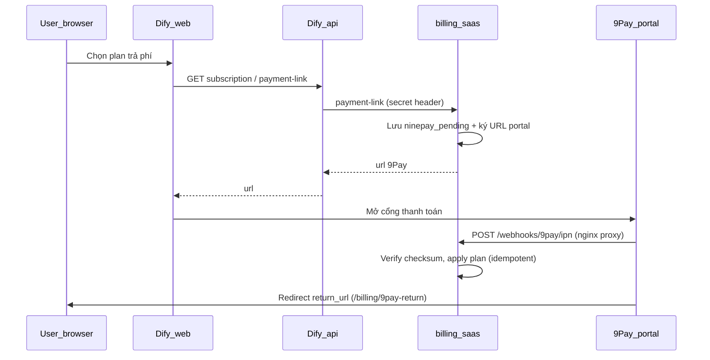

# Tích hợp 9Pay (Dify fork) — tài liệu vận hành & kỹ thuật

Tài liệu này tóm tắt **luồng thanh toán 9Pay**, **phần đã triển khai trong repo**, và **cách cấu hình credential**.  
**Không** chèn Merchant Secret / Checksum / mật khẩu Merchant View vào git — giữ trong `docker/.env` (đã gitignore) và kho 9Pay.

---

## 1. Tổng quan 9Pay trong bản fork

| Thành phần | Vai trò |
|-------------|---------|
| **Console (Next.js)** | Người dùng chọn gói → gọi API Dify → nhận URL thanh toán → mở tab cổng 9Pay hoặc trang stub `/billing/checkout`. |
| **API Dify (`api`)** | `BillingService` gọi dịch vụ billing qua HTTP. |
| **`billing_saas`** | Dịch vụ nhỏ tương thích contract billing: tạo URL portal 9Pay (HMAC), nhận **IPN**, **inquire** trạng thái, **refund** (API nội bộ), lưu plan tenant (SQLite). |
| **Nginx** | Proxy công khai `POST /webhooks/9pay/ipn` → `billing_saas:8000`. |

**Sandbox (thử nghiệm)**

| Mục | URL |
|-----|-----|
| Cổng thanh toán (redirect portal) | `https://sand-payment.9pay.vn` |
| Merchant View (tra cứu GD, cấu hình) | `https://sand-business.9pay.vn` |
| Tài liệu developer | `https://developers.9pay.vn` |
| Mẫu ký PHP (inquire / refund REST) | `https://gitlab.com/9pay-sample/sample-php` |

**Production** (khi 9Pay cấp sau UAT): domain `payment.9pay.vn` / `business.9pay.vn` — đổi `NINEPAY_ENDPOINT` và URL đăng ký IPN tương ứng.

---

## 2. Credential & tài khoản (bạn tự điền — không commit secret)

### 2.1. Key kết nối API (lấy từ 9Pay / email tích hợp)

Lưu trong **`docker/.env`** (cùng thư mục với file này):

| Biến | Ý nghĩa |
|------|---------|
| `NINEPAY_MERCHANT_KEY` | Định danh merchant (Credential trên header REST). |
| `NINEPAY_SECRET_KEY` | Ký HMAC portal + ký message REST (inquire/refund). |
| `NINEPAY_CHECKSUM_KEY` | Xác thực **IPN** (`SHA256(result + key)` so với `checksum`). |

**Không** copy các giá trị thật vào file Markdown trong repo.

### 2.2. Merchant View (web, do 9Pay cấp)

- **URL sandbox:** `https://sand-business.9pay.vn`  
- **Username / password:** do 9Pay cấp khi tích hợp — dùng để đăng nhập tra cứu giao dịch, cấu hình IPN, v.v.  
- **Không** lưu mật khẩu Merchant View trong git; dùng password manager hoặc ghi riêng ngoài repo.

### 2.3. Thẻ test (thẻ quốc tế sandbox — theo doc 9Pay)

- Số thẻ ví dụ: `4456 5300 0000 1005`  
- Chủ thẻ: `NGUYEN VAN A`  
- Hết hạn / CVV / OTP: theo hướng dẫn trang [Redirect thẻ quốc tế](https://developers.9pay.vn/thanh-toan-the-quoc-te/redirect).

---

## 3. Biến môi trường billing + 9Pay (tham chiếu nhanh)

| Biến | Ghi chú |
|------|---------|
| `BILLING_ENABLED` | Bật billing trên API. |
| `BILLING_API_URL` | Trong Docker: `http://billing_saas:8000`. |
| `BILLING_API_SECRET_KEY` | Header `Billing-Api-Secret-Key` — khớp giữa API và `billing_saas`. |
| `NINEPAY_ENABLED` | `true` để tạo URL cổng thật. |
| `NINEPAY_ENDPOINT` | Sandbox: `https://sand-payment.9pay.vn`. |
| `NINEPAY_RETURN_URL_BASE` | HTTPS công khai tới trang `/billing/9pay-return` (tunnel hoặc domain). |
| `NINEPAY_PLAN_AMOUNTS_VND` | JSON `plan_interval` → số tiền VND (tối thiểu 10.000). |
| `NINEPAY_METHOD` | **Để trống / không đặt** → cổng 9Pay cho chọn nhiều phương thức (QR, ATM, ví, thẻ… nếu merchant đã bật). `CREDIT_CARD` = ép luồng thẻ quốc tế. |
| `NINEPAY_TRANSACTION_TYPE` | Tuỳ doc 9Pay / account. |
| `NINEPAY_LANG`, `NINEPAY_CURRENCY` | Tuỳ chọn (`vi`, `VND`). |
| `NINEPAY_BANK_CODE`, `NINEPAY_PROFILE_ID`, `NINEPAY_CARD_*`, `NINEPAY_CAMPAIGN_ID` | Tuỳ doc redirect thẻ QT / nghiệp vụ. |
| `NINEPAY_INQUIRE_POLL_SECONDS` | Chu kỳ poll inquire (mặc định 900). |
| `NINEPAY_INQUIRE_AFTER_SECONDS` | Pending đủ “cũ” mới inquire (mặc định 1200). |
| `BILLING_CHECKOUT_BASE_URL` | URL stub khi chưa bật 9Pay / fallback. |
| `BILLING_INVOICES_URL` | Stub hóa đơn. |

Chi tiết thêm: `docker/env.billing.activate.example`.

---

## 4. Luồng kỹ thuật (tóm tắt)

- **IPN công khai:** đăng ký trên merchant 9Pay:  
  `https://<host-công-khai>/webhooks/9pay/ipn`  
  Nginx trong repo đã `proxy_pass` tới `billing_saas`.

---

## 5. Những gì đã làm trong code (thống kê theo chủ đề)

| Hạng mục | Nội dung |
|----------|----------|
| Portal redirect | [`billing_saas/app/ninepay.py`](../billing_saas/app/ninepay.py) — ký giống sample JS/PHP; thêm tham số doc: `lang`, `currency`, `bank_code`, `profile_id`, `card_*`, `campaign_id`. |
| REST 9Pay | [`billing_saas/app/ninepay_rest.py`](../billing_saas/app/ninepay_rest.py) — inquire `GET /v2/payments/{invoice}/inquire`, refund `POST /v2/refunds/create`, refund inquire (ký theo GitLab PHP MessageBuilder). |
| API FastAPI | [`billing_saas/app/main.py`](../billing_saas/app/main.py) — `payment-link`, IPN, poll inquire nền, internal sync/refund/inquire. |
| Idempotent | Bảng `ninepay_applied` + `try_apply_ninepay_success` trong [`billing_saas/app/store.py`](../billing_saas/app/store.py). |
| Nginx | [`docker/nginx/conf.d/default.conf.template`](nginx/conf.d/default.conf.template) — `location /webhooks/9pay/ipn`. |
| Compose / env mẫu | `docker-compose.yaml`, `docker-compose-template.yaml`, `env.billing.activate.example`. |
| Web | Trang stub `/billing/checkout`, return `/billing/9pay-return`, i18n `web/i18n/.../billing.json`. |
| Test | `billing_saas/tests/test_ninepay*.py`. |

---

## 6. API nội bộ `billing_saas` (cần header bí mật)

Header: `Billing-Api-Secret-Key: <BILLING_API_SECRET_KEY>`

| Method | Path | Mục đích |
|--------|------|----------|
| `POST` | `/internal/ninepay/sync-stale-pending` | Chạy một vòng inquire cho pending “cũ”. |
| `GET` | `/internal/ninepay/inquire/{invoice_no}` | Xem JSON inquire (debug). |
| `POST` | `/internal/ninepay/refund` | Tạo hoàn tiền (body: `request_id`, `payment_no`, `amount`, `description`, …). |
| `GET` | `/internal/ninepay/refund-inquire/{request_id}` | Trạng thái hoàn. |

**Lưu ý:** Hoàn tiền có **IPN riêng** trên merchant (`ipn_refund_url`) — chưa có webhook handler refund trong fork; cần bổ sung nếu nghiệp vụ dùng.

---

## 7. Checklist vận hành

1. `docker/.env` có đủ `NINEPAY_*` + `BILLING_*`; không commit `.env`.  
2. `docker compose up -d --force-recreate billing_saas nginx` sau khi sửa env / template nginx.  
3. Đăng ký IPN thanh toán đúng URL công khai `/webhooks/9pay/ipn`.  
4. `NINEPAY_RETURN_URL_BASE` trỏ HTTPS tới `/billing/9pay-return`.  
5. Muốn nhiều phương thức trên cổng: **không** đặt `NINEPAY_METHOD` (hoặc để trống).  
6. Sandbox: xác nhận trên Merchant View các sản phẩm (QR, ATM, ví…) đã bật cho merchant.

---

## 8. File tham chiếu nhanh trong repo

- Billing service: `billing_saas/`  
- Docker & env: `docker/docker-compose.yaml`, `docker/.env`, `docker/env.billing.activate.example`  
- Build web (Windows / symlink): `docker/build-web.ps1`  
- Tài liệu 9Pay: [developers.9pay.vn](https://developers.9pay.vn)

---

*Bản cập nhật: tích hợp fork Dify — dùng nội bộ; xoay key nếu từng lộ trong chat/email.*
